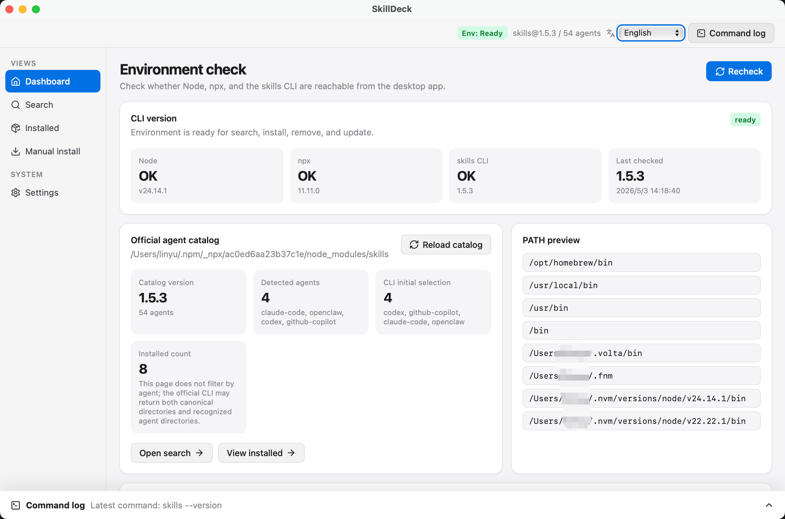

<div align="center">

# SkillDeck

A cross-platform desktop UI for the official `npx skills` CLI.

[](https://tauri.app/)
[](https://react.dev/)
[](https://www.typescriptlang.org/)
[](#release)
[](#license)

[中文](README.md)



</div>

SkillDeck helps you search, install, inspect, update, and remove AI Agent skills.

Upstream: official CLI [vercel-labs/skills](https://github.com/vercel-labs/skills), skills directory [skills.sh](https://skills.sh).

## Why SkillDeck

- **Cross-platform desktop app**: built with Tauri v2 for macOS, Windows, and Linux.
- **Close to the official CLI**: executes the official `npx skills` commands instead of redefining install behavior.
- **Explicit install target**: project-scoped installs require a concrete target project directory, so skills are not accidentally installed into the app directory.
- **Safer Agent selection**: only detected Agents are preselected; unavailable targets are not selected automatically.
- **Visible command execution**: installation opens the command log and streams stdout / stderr in real time.
- **Decoupled persistent logs**: command results are written to the OS app log directory through the official Tauri log plugin.

## Features

- Checks local Node.js, npx, and `skills` CLI availability.
- Loads the official agent catalog and only preselects detected agents.
- Searches installable skills through `npx skills find`.
- Supports both global and project-scoped installation; project installs require an explicit target project directory.
- Opens the command log after installation starts and streams stdout / stderr in real time.
- Lists installed skills and supports update / remove actions.
- Writes persistent command logs to the OS app log directory through the official Tauri log plugin.
- Builds desktop bundles for macOS, Windows, and Linux through GitHub Actions.
- Provides Chinese / English UI.

## Requirements

- Node.js and npx
- Rust toolchain
- Network access to npm and skill source repositories

## Development

```bash
npm install
npm run tauri:dev
```

`npm run tauri:dev` starts the full Tauri desktop app with frontend hot reload. `npm run dev` only starts the Vite frontend server; Tauri API calls will fail without the desktop runtime.

Useful checks:

```bash
npm run typecheck
cargo test --manifest-path src-tauri/Cargo.toml
npm run tauri:build
```

## Install Scope

SkillDeck follows the official `npx skills` CLI semantics:

- Global install: installs into the selected Agent's user-level skills directory.
- Project install: runs `npx skills add` from the explicitly selected target project directory, not from the SkillDeck app directory.

If an Agent is not detected, SkillDeck does not preselect it as an install target.

## Logs

SkillDeck exposes two log surfaces:

- UI command log: streams live output while install, update, and remove commands run.
- Persistent command log: writes command results to the OS app log directory through the official Tauri log plugin.

The command log file is named `commands.log` and is written to:

| Platform | Path |
|----------|------|
| macOS | `~/Library/Logs/com.skilldeck.desktop/commands.log` |
| Windows | `%LOCALAPPDATA%\com.skilldeck.desktop\logs\commands.log` |
| Linux | `$XDG_DATA_HOME/com.skilldeck.desktop/logs/commands.log`, or `~/.local/share/com.skilldeck.desktop/logs/commands.log` when `XDG_DATA_HOME` is not set |

## Stack

- Tauri v2
- Rust
- React 19
- TypeScript
- Vite
- official `npx skills` CLI

## Release

This repository includes a GitHub Actions release workflow. Pushing a `v*` tag or manually dispatching the workflow builds desktop bundles for macOS, Windows, and Linux; tag builds also create a draft release and upload the Tauri updater `latest.json` asset.

In-app updates are available starting with `v0.1.1`; an installed `v0.1.0` build does not include the updater and cannot update itself to `v0.1.1`. The Tauri updater signature only verifies package integrity; it does not replace macOS Developer ID signing or notarization.

Release bundles are built by GitHub Actions. Because the project has not yet integrated platform code signing and notarization, operating systems may show warnings such as "unverified developer" or "unknown publisher". This means the OS cannot verify the publisher identity; only download builds from this repository's GitHub Releases, and continue only after confirming the source is trusted.

When the operating system shows a security warning:

- macOS: after the first launch is blocked, open System Settings > Privacy & Security, then choose to open the app from the security notice.
- Windows: if SmartScreen shows an unknown publisher warning, confirm the file came from this repository's Releases, then choose More info and continue running it.
- Linux: use `.deb` for regular installation; in-app updates use the AppImage updater package. If the desktop environment blocks launch, allow the file to run as a program in file properties, or install it through the system software installer.

## License

MIT
