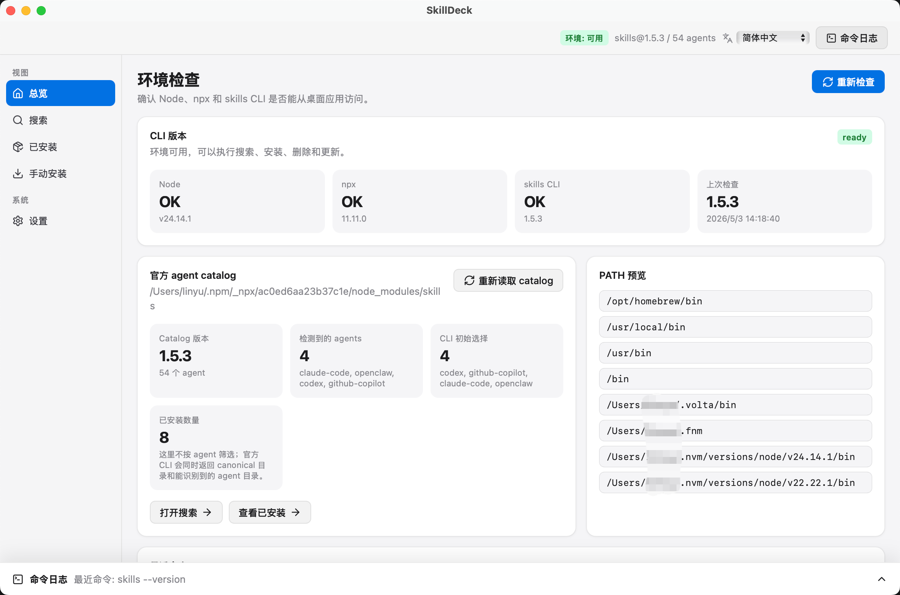

<div align="center">

# SkillDeck

跨平台的官方 `npx skills` CLI 桌面管理界面。

[](https://tauri.app/)
[](https://react.dev/)
[](https://www.typescriptlang.org/)
[](#发布)
[](#license)

[English](README.en.md)

</div>

SkillDeck 用于搜索、安装、查看、更新和移除 AI Agent skills。

上游项目：官方 CLI [vercel-labs/skills](https://github.com/vercel-labs/skills)，技能目录 [skills.sh](https://skills.sh)。


## 为什么选择 SkillDeck

- **跨平台桌面体验**：基于 Tauri v2 构建，面向 macOS、Windows 和 Linux 发布。
- **贴近官方 CLI**：底层仍执行官方 `npx skills` 命令，不重新定义安装语义。
- **安装目标明确**：项目范围安装必须选择具体项目目录，避免误装到当前 App 目录。
- **Agent 选择更安全**：只默认选择已检测到的 Agent，未检测到的目标不会被自动选中。
- **命令过程可见**：安装开始后自动进入日志页，并实时显示 stdout / stderr。
- **日志解耦落盘**：通过 Tauri 官方日志插件写入系统应用日志目录，便于排查历史命令。

## 功能

- 检测本机 Node.js、npx 与 `skills` CLI 环境状态。
- 读取官方 agent catalog，只展示当前已检测到的 Agent。
- 通过 `npx skills find` 搜索可安装技能。
- 支持全局安装与项目范围安装；项目范围安装必须显式选择目标项目目录。
- 执行安装后自动进入命令日志页，并实时显示 stdout / stderr 输出。
- 查看已安装技能，并执行更新或移除。
- 使用 Tauri 官方日志插件将命令日志写入系统应用日志目录。
- 通过 GitHub Actions 构建 macOS、Windows 和 Linux 桌面包。
- 支持中文 / English 界面。

## 运行要求

- Node.js 与 npx
- Rust 工具链
- 可访问 npm 与技能来源仓库的网络环境

## 本地开发

```bash
npm install
npm run tauri:dev
```

`npm run tauri:dev` 会启动完整 Tauri 桌面应用和前端热重载。单独运行 `npm run dev` 只会启动 Vite 前端服务，没有 Tauri 运行时，因此桌面 API 调用会失败。

常用检查命令：

```bash
npm run typecheck
cargo test --manifest-path src-tauri/Cargo.toml
npm run tauri:build
```

## 安装范围

SkillDeck 保持与官方 `npx skills` CLI 一致的安装语义：

- 全局安装：安装到所选 Agent 的用户级 skills 目录。
- 项目安装：必须先选择目标项目目录，后端会在该目录下执行 `npx skills add`，不会默认安装到 SkillDeck 应用自身目录。

如果没有检测到某个 Agent，SkillDeck 不会默认选中它作为安装目标。

## 日志

SkillDeck 有两类日志：

- 界面命令日志：安装、更新、移除等命令执行时实时显示输出。
- 持久化命令日志：通过 Tauri 官方日志插件写入系统应用日志目录，用于排查历史命令执行结果。

命令日志文件名为 `commands.log`，默认位置：

| 平台    | 路径                                                                                                                                                 |
| ------- | ---------------------------------------------------------------------------------------------------------------------------------------------------- |
| macOS   | `~/Library/Logs/com.skilldeck.desktop/commands.log`                                                                                                |
| Windows | `%LOCALAPPDATA%\com.skilldeck.desktop\logs\commands.log`                                                                                           |
| Linux   | `$XDG_DATA_HOME/com.skilldeck.desktop/logs/commands.log`，未设置 `XDG_DATA_HOME` 时为 `~/.local/share/com.skilldeck.desktop/logs/commands.log` |

## 技术栈

- Tauri v2
- Rust
- React 19
- TypeScript
- Vite
- official `npx skills` CLI

## 发布

仓库包含 GitHub Actions release workflow。推送 `v*` tag 或手动触发 workflow 后，会构建 macOS、Windows 和 Linux 桌面包；tag 触发时会创建 draft release。

当前发布包由 GitHub Actions 自动构建。由于项目暂未接入平台代码签名与公证，不同系统可能显示“无法验证开发者”“未知发布者”等安全提示。这表示操作系统无法确认发布者身份；请只从本仓库 GitHub Releases 下载，并在确认来源可信后继续安装。

遇到系统安全提示时：

- macOS：首次打开被拦截后，进入“系统设置”→“隐私与安全性”，在安全提示中选择仍要打开。
- Windows：如果 SmartScreen 显示未知发布者，确认文件来自本仓库 Releases 后，在提示中选择更多信息并继续运行。
- Linux：优先使用对应发行版支持的安装包；如果桌面环境阻止启动，请在文件属性中允许作为程序运行，或通过系统软件安装器安装。

## License

MIT
